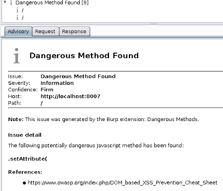

# Dangerous Methods
A Burp Suite Professional extension for finding the use of potentially dangerous methods/functions in Javascript, jQuery, AngularJS, and others.

* Powered by regular expressions
* Creates informational issues in Burp Suite
* Written in Python
* Requires Jython 2.7+ 
* x checks in 3 frameworks/languages
* Pull requests welcome!

### Screenshots
[]

### Todo
* Collect references

* Make regexes longer/more robust
* Send output properly
* Add new dangerous methods
    * Look into templating languages
* Add extension information to registerExtenderCallbacks output
* ~~Find out if Burp Pro is needed~~
* ~~Throw exceptions where needed~~
* Add ~~screenshots~~